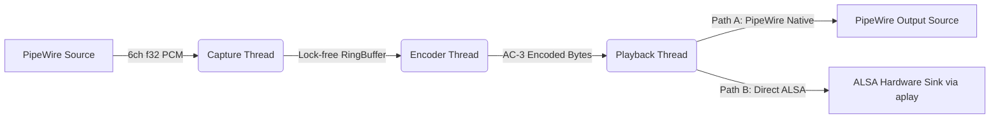

# Architecture & Design

## Overview
`pw-ac3-live` is designed to bridge the gap between modern multi-channel audio sources (games, media players) and legacy or restricted hardware sinks (HDMI ARC/SPDIF) on Linux/PipeWire systems.

## Data Flow Pipeline

## Threading Model

To ensure glitch-free audio, we strictly separate real-time (RT) tasks from compute-intensive or blocking tasks.

### 1. Capture Thread (RT-Safe)
*   **Context**: PipeWire `process` callback.
*   **Priority**: Real-time (SCHED_FIFO).
*   **Graph Node**: Creates `pw-ac3-live-input` (Virtual 5.1 Sink to other apps).
*   **Constraints**:
    *   Avoid blocking operations.
    *   Avoid long critical sections.
    *   Keep callback work bounded to prevent xruns.
*   **Responsibility**:
    *   Read 6-channel capture input (`F32LE`) from PipeWire buffers.
    *   Parse either:
        * single interleaved buffer (`datas=1`, stride-based), or
        * multi-buffer planar layout.
    *   Validate buffer boundaries/alignment and write frame-aligned samples to the `InputRingBuffer`.

### 2. Encoder Mechanism (Subprocess)
*   **Component**: `ffmpeg` binary spawned as a child process.
*   **Responsibility**:
    *   Reads raw f32le 6-channel audio from stdin.
    *   Encodes to AC-3 at 640kbps.
    *   Encapsulates in IEC 61937 (S/PDIF) format.
    *   Writes S16LE stereo stream to stdout.

### 3. Feeder & Reader Threads
*   **Context**: Standard OS threads (`std::thread`).
*   **Responsibility**:
    *   **Feeder**: Moves data from InputRingBuffer to FFmpeg's stdin.
    *   **Reader**: Moves data from FFmpeg's stdout to OutputRingBuffer.
    *   **Shutdown behavior**: Handles output backpressure and exits promptly when shutdown is requested, even if the output ring is full.

### 4. Playback & Output Architecture

The encoded IEC 61937 stream is delivered to the hardware via one of two possible output paths, selected by the platform-specific launcher script.

#### Path A: PipeWire Native
The standard output path for desktop Linux setups where PipeWire's ALSA plugin performs well.
*   **Used by**: `scripts/launch_live_laptop.sh`
*   **Context**: Playback Thread (RT-Safe), running in PipeWire `process` callback.
*   **Priority**: Real-time (SCHED_FIFO).
*   **Mechanism**: Writes audio data to a PipeWire output buffer.
*   **Graph Node**: Creates `pw-ac3-live-output` (Audio/Source, 2ch S16LE, IEC61937).
*   **Volume**: The script attempts to force volumes to 100% (0dB). Software attenuation *must* be avoided to prevent bitstream corruption.
*   **Routing**: Standard PipeWire linking to a target sink.

#### Path B: Direct ALSA
The output path for platforms where PipeWire's ALSA sink plugin introduces unacceptable scheduling jitter for encoded bitstreams (e.g., the Steam Deck with Valve Dock).
*   **Used by**: `scripts/launch_live_steamdeck.sh`
*   **Mechanism**: The application writes encoded data to `stdout`. The launcher script pipes this directly to `aplay` for exclusive hardware access.
*   **Graph Node**: No output node is created in the PipeWire graph.
*   **Exclusive Access Process**:
    1.  **Device Identification**: The script targets `hw:0,8` (Valve Dock HDMI).
    2.  **Internal Speaker Isolation**: The script captures and disables the internal speaker card profile (`alsa_card.pci-0000_04_00.5-platform-nau8821-max -> off`) to prevent fallback playback leaks during transitions.
    3.  **HDMI Profile Disabling**: The script disables the HDMI card profile (`alsa_card.pci-0000_04_00.1 -> off`) to release the ALSA device and unlock IEC958 controls.
    4.  **IEC958 Configuration**: The script uses `iecset -c 0 -n 2 audio off rate 48000` to force status bits to "Non-Audio" (compressed).
    5.  **Playback**: `aplay` takes exclusive control of `hw:0,8`.
    6.  **Cleanup**: On exit, the script stops the pipeline, restores IEC958 status to "Audio" (PCM), restores HDMI card/default sink, and restores the original internal speaker profile.
*   **Volume**: The script unmutes hardware controls (`amixer`) but relies on `aplay` passing raw data. Software volume is effectively bypassed.

## Launcher Architecture

The project splits launch logic into two distinct scripts, each implementing the output path best suited to its target platform:

### 1. `scripts/launch_live_steamdeck.sh`
*   **Target Hardware**: Valve Steam Deck Docking Station.
*   **Output Path**: **Direct ALSA** (`aplay` to `hw:0,8`).
*   **Behavior**:
    *   Hardcoded Steam Deck card IDs and loopback sink names (no runtime hardware discovery).
    *   Uses direct `aplay` passthrough to the hardware to avoid PipeWire scheduling jitter/stuttering on the Deck.
    *   Manages IEC958 Non-Audio bit configuration plus internal-speaker profile disable/restore for leak prevention.
    *   Restores HDMI profile/default sink and internal speaker profile during cleanup.

### 2. `scripts/launch_live_laptop.sh`
*   **Target Hardware**: Generic Linux desktop/laptop.
*   **Output Path**: **PipeWire Native** (in-graph playback stream).
*   **Behavior**:
    *   Dynamic scanning for PCI sound cards and `hdmi-stereo` sinks.
    *   Low-latency defaults (`64` frames) for responsive desktop usage.
    *   Standard `pactl` profile switching logic.
